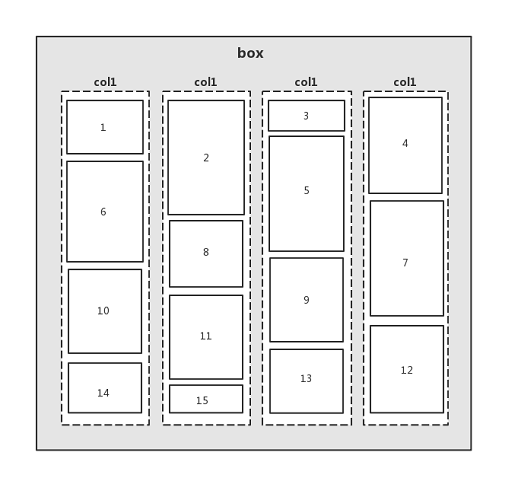

### `vue`使用列表渲染 实现瀑布流布局

最近一个`vue`项目需要瀑布流布局，最终结合自己的需求使用了`vue`的`v-for`实现了，整理了一下。

#### 结构示意图

(用 <a href="https://www.processon.com" target="_blank">`Process`</a> 在线画图工具画的)



##### 说明

- 外层容器的box高度不固定
- 每列col的宽度可自定义
- 列数可自定义，取决于有几个数据`dataList`，每个列的数据对应一个``dataList`
- 页面布局结构代码

```html
  <div class="box">
    <div class="col" ref="col1">
      <transition-group name="list">
        <div class="item" v-for="item in dataList1" :key="item.id">{{item.text}}</div>
      </transition-group>
    </div>
    <div class="col" ref="col2">
      <transition-group name="list">
        <div class="item" v-for="item in dataList2" :key="item.id">{{item.text}}</div>
      </transition-group>
    </div>
    <div class="col" ref="col3">
      <transition-group name="list">
        <div class="item" v-for="item in dataList3" :key="item.id">{{item.text}}</div>
      </transition-group>
    </div>
    <div class="col" ref="col4">
      <transition-group name="list">
        <div class="item" v-for="item in dataList4" :key="item.id">{{item.text}}</div>
      </transition-group>
    </div>
  </div>
```

#### 加载数据

- 使用`axios`

```js
/** main.js*/
import Vue from 'vue'
import App from './App.vue'
import axios from 'axios'

Vue.prototype.$http = axios

new Vue({
  el: '#app',
  render: h => h(App)
})

```

- 当组件`mounted`时获取数据，获取到数据后执行`mountMenu()`方法，`mountMenu()`方法将会通过`selectCol()`选择当前高度最小的列，并把数据`push`到对应的`dataList`中，``mountMenu()`会在每次执行时递归调用，直到遍历完所有的数据

```js
/** 数据实例子*/
[
  {
    id:1002,
    text:"mountMenu()中调用了this.$nextTick()目的是等待当前DOM渲染完成后在继续执行，否则在获取最小高度的列时，每次获取到的高度都为0（vm.nextTick()vue官方文档）"
  }
]
```
- <span style='color:red;font-weight:bold'>重要信息</span>：`mountMenu()`中调用了`this.$nextTick()`目的是等待当前DOM渲染完成后在继续执行，否则在获取最小高度的列时，每次获取到的高度都为0（<a href="<https://cn.vuejs.org/v2/api/#vm-nextTick>" target="_blank">`vm.nextTick()`vue官方文档</a>）

```js
export default {
  data() {
    return {
      mainMenuList: [],
      dataList1: [],
      dataList2: [],
      dataList3: [],
      dataList4: [],
    }
  },
  mounted() {
    this.$http({ url: 'http://localhost:6060/paragraph', method: 'get' }).then(res => {
      this.mainMenuList = res.data
      this.mountMenu()
    })
  },
  methods: {
    mountMenu(arg) {
      var temp = this.mainMenuList
      var index = arg || 0
      var refName = this.selectCol()
      if (temp.length > index) {
        this[refName].push(this.mainMenuList[index])
        this.$nextTick(() => {
          this.mountMenu(index + 1)
        })
      }
    },
    selectCol() {
      var getHeight = (ref) => {
        return this.$refs[ref].offsetHeight
      }
      var height1 = getHeight('col1')
      var height2 = getHeight('col2')
      var height3 = getHeight('col3')
      var height4 = getHeight('col4')
      switch (Math.min(height1, height2, height3, height4)) {
        case height1:
          return 'dataList1'
          break
        case height2:
          return 'dataList2'
          break
        case height3:
          return 'dataList3'
        case height4:
          return 'dataList4'
          break
      }
    },
  }
}
```

- **ie浏览器的BUG**:上述代码在ie浏览器（`ie 9/10/11`）中会遇到动画的bug，目前我的解决方案就是js判断浏览器，在ie中禁用过渡动画（![[doge]](https://img.t.sinajs.cn/t4/appstyle/expression/ext/normal/a1/2018new_doge02_org.png))

```js
computed: {
    isIe() {
      var tmp = window.navigator.userAgent.indexOf("MSIE") >= 1
        || !!window.ActiveXObject
        || "ActiveXObject" in window
      return tmp ? "" : "list"
    }
}
```

```html
<transition-group :name="isIe">
  <div class="item" v-for="item in dataList1" :key="item.id">{{item.text}}</div>
</transition-group>
```

